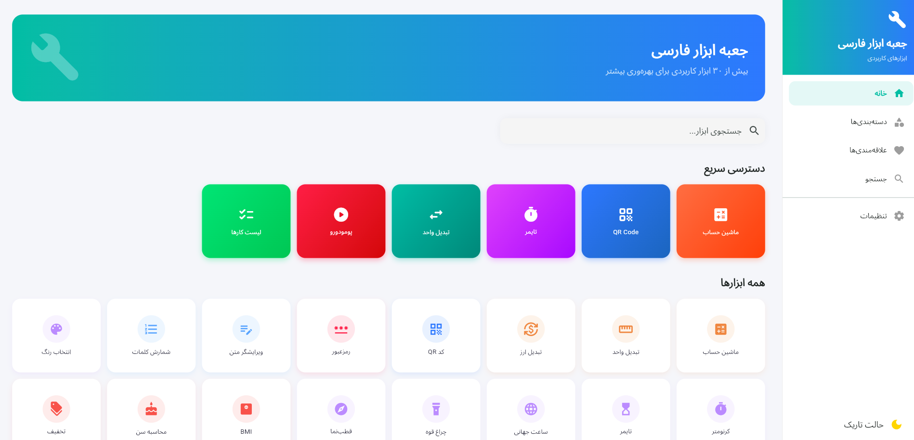

# جعبه ابزار دانیال

<div align="center">
  
</div>

<br>

یک اپلیکیشن جامع ابزارهای کاربردی با رابط کاربری کاملاً فارسی، ساخته شده با Flutter. این برنامه بیش از ۳۰ ابزار متنوع در دسته‌بندی‌های مختلف ارائه می‌دهد.

## امکانات

### ابزارهای محاسبه و تبدیل
- ماشین حساب科学ی با اعداد فارسی
- تبدیل واحد (طول، وزن، دما، حجم، مساحت، سرعت، داده، زمان، انرژی، توان، فشار، زاویه)
- تبدیل ارز (دلار، یورو، پوند، درهم، لیر، یوان)
- سازنده کد QR با رنگ‌های دلخواه
- سازنده رمز عبور امن با نشانگر قدرت

### ابزارهای متنی
- ویرایشگر متن با شمارش کلمات و کاراکترها
- شمارش کلمات

### ابزارهای روزمره
- انتخابگر رنگ با لغزنده‌های RGB
- کرنومتر با پیگیری دورها
- تایمر با زمان‌های از پیش تنظیم شده
- ساعت جهانی برای چند شهر
- چراغ قوه
- قطب‌نما با رسم سفارشی

### ابزارهای سلامت
- ماشین حساب BMI با نمودار دسته‌بندی
- محاسبه سن با تقویم جلالی
- محاسبه تخفیف
- محاسبه انعام با تقسیم صورت حساب

### ابزارهای سنسور
- شتاب‌سنج با نمایش سه‌بعدی
- ژیروسکوپ با نمایش چرخش
- فشارسنج با محاسبه ارتفاع

### ابزارهای بهره‌وری
- تایمر پومودورو با جلسات و استراحت
- لیست کارها با دسته‌بندی و اولویت
- یادداشت‌ها با برچسب‌ها
- ردیاب عادت با رگه‌های هفتگی
- برنامه روزانه ساعتی
- تولیدکننده نویز سفید با ۱۲ صدا
- تایمر جلسه با دستور کار
- تایمر ارائه با نشانه‌های بصری
- سازنده نقشه ذهنی

### ابزارهای سرگرمی
- تولیدکننده عدد تصادفی

## ویژگی‌های فنی

- رابط کاربری کاملاً فارسی با پشتیبانی RTL
- طراحی واکنش‌گرا (موبایل، تبلت، دسکتاپ)
- تم تاریک و روشن با ذخیره‌سازی پایدار
- مدیریت state با GetX
- ذخیره‌سازی محلی با Hive
- تقویم جلالی
- اعداد فارسی (۰-۹)
- رنگ‌بندی الهام گرفته از هنر ایرانی

## نصب و راه‌اندازی

### پیش‌نیازها
- Flutter SDK 3.44.6 یا بالاتر
- Dart SDK 3.12.2 یا بالاتر

### مراحل نصب
```bash
# کلون کردن مخزن
git clone https://github.com/danialchoopan/toolboxFlutterDanial.git

# رفتن به پروژه
cd toolboxFlutterDanial

# نصب وابستگی‌ها
flutter pub get

# اجرای برنامه
flutter run
```

### پیکربندی پروکسی (در صورت نیاز)
```bash
export http_proxy=http://127.0.0.1:2080
export https_proxy=http://127.0.0.1:2080
flutter pub get
```

## ساختار پروژه

```
lib/
├── main.dart                    # نقطه ورود برنامه
├── core/
│   ├── constants/               # رنگ‌ها، ابعاد، سبک‌های متن
│   ├── localization/            # ترجمه‌های فارسی، اعداد، تاریخ
│   ├── router/                  # مسیرهای GetX
│   ├── services/                # سرویس ذخیره‌سازی Hive
│   └── theme/                   # تم‌های تاریک و روشن
├── modules/
│   ├── home/                    # صفحه اصلی و کنترلر
│   ├── settings/                # صفحه تنظیمات
│   └── tools/                   # تمام صفحات ابزارها
└── widgets/
    ├── common/                  # ویجت‌های قابل استفاده مجدد
    └── navigation/              # نوار پایین و کشویی
```

## مجوز

خصوصی - تمامی حقوق محفوظ است.

---

<br>

# Danial's Toolbox

<div align="center">
  
</div>

<br>

A comprehensive utility toolbox application with a fully localized Persian (Farsi) UI, built with Flutter. The app provides 30+ tools across various categories.

## Features

### Calculator & Conversion Tools
- Scientific calculator with Persian digits
- Unit converter (length, weight, temperature, volume, area, speed, data, time, energy, power, pressure, angle)
- Currency converter (USD, EUR, GBP, AED, TRY, CNY)
- QR code generator with custom colors
- Secure password generator with strength indicator

### Text Tools
- Text editor with word/character counter
- Word counter

### Daily Utilities
- Color picker with RGB sliders
- Stopwatch with lap tracking
- Timer with presets
- World clock for multiple cities
- Flashlight
- Custom painted compass

### Health Tools
- BMI calculator with category visualization
- Age calculator with Persian calendar
- Discount calculator
- Tip calculator with bill splitting

### Sensor Tools
- Accelerometer with 3D visualization
- Gyroscope with rotation display
- Barometer with altitude calculation

### Productivity Tools
- Pomodoro timer with sessions and breaks
- To-do list with categories and priorities
- Notes with tags
- Habit tracker with weekly streaks
- Hourly daily planner
- White noise generator with 12 sounds
- Meeting timer with agenda
- Presentation timer with visual cues
- Mind map creator

### Fun Tools
- Random number generator

## Technical Features

- Fully Persian UI with RTL support
- Responsive design (mobile, tablet, desktop)
- Dark and Light themes with persistent storage
- State management with GetX
- Local storage with Hive
- Persian calendar (Jalali)
- Persian numerals (۰-۹)
- Persian art-inspired color palette

## Getting Started

### Prerequisites
- Flutter SDK 3.44.6 or higher
- Dart SDK 3.12.2 or higher

### Installation
```bash
# Clone the repository
git clone https://github.com/danialchoopan/toolboxFlutterDanial.git

# Navigate to project
cd toolboxFlutterDanial

# Install dependencies
flutter pub get

# Run the app
flutter run
```

### Proxy Configuration (if needed)
```bash
export http_proxy=http://127.0.0.1:2080
export https_proxy=http://127.0.0.1:2080
flutter pub get
```

## Project Structure

```
lib/
├── main.dart                    # App entry point
├── core/
│   ├── constants/               # Colors, dimensions, text styles
│   ├── localization/            # Persian translations, numbers, dates
│   ├── router/                  # GetX route definitions
│   ├── services/                # Hive storage service
│   └── theme/                   # Light/Dark themes
├── modules/
│   ├── home/                    # Home screen + controller
│   ├── settings/                # Settings screen
│   └── tools/                   # All tool screens
└── widgets/
    ├── common/                  # Reusable widgets
    └── navigation/              # Bottom nav, drawer
```

## License

Private - All rights reserved.
